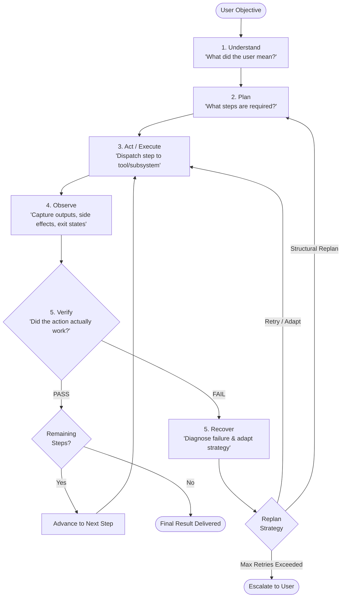

# JARVIS Architecture Specification

> **System Paradigm**: Continuous Agentic Feedback Loop  
> **Core Principle**: *"Architecture before LLM"* — The reliability of JARVIS is governed by its control loop, deterministic verification gates, and recovery mechanics, not raw model weights.

---

## 1. The Five Fundamental Capabilities

JARVIS is built upon five decoupled, typed capabilities:



### 1.1. Understand — *"What did the user mean?"*
- **Inputs**: Raw natural language prompt, session context, active window/environment metadata, memory references.
- **Responsibilities**:
  - Semantic intent classification (e.g. `QUERY`, `TASK_AUTOMATION`, `RESEARCH`, `SYSTEM_COMMAND`, `MEDIA_CONTROL`).
  - Entity & parameter extraction with constraints.
  - Ambiguity detection: If confidence < threshold or critical arguments are missing, generate clarification requests instead of hallucinating defaults.
- **Output**: `TaskObjective` schema with clear goal criteria.

### 1.2. Plan — *"What steps are required?"*
- **Inputs**: Validated `TaskObjective`, registered tool registry, environment capability profile.
- **Responsibilities**:
  - Decomposes the objective into an ordered or DAG-structured series of `PlanStep` items.
  - Assigns each step to an execution subsystem:
    - `LOCAL`: Offline SLM, local embeddings, vector queries.
    - `WEB`: Headless/headful browser, search engines, frontier cloud LLMs.
    - `SYSTEM`: Windows OS API, PowerShell, file system, process execution.
  - Pre-calculates expected verification criteria for each step.
- **Output**: `ExecutionPlan` containing an array of `PlanStep`.

### 1.3. Act — *"What tools can accomplish those steps?"*
- **Inputs**: Current active `PlanStep`, runtime context, credential/sandbox boundary.
- **Responsibilities**:
  - Schema-validates tool parameters before invocation.
  - Executes tool across the target subsystem.
  - Enforces safety gates (e.g., prompting confirmation for destructive actions).
- **Output**: Direct execution handle & process lifecycle management.

### 1.4. Observe — *"Did the action actually work?"*
- **Inputs**: Subsystem raw outputs (stdout, stderr, returncode, DOM mutation, screenshots, file system diffs).
- **Responsibilities**:
  - Captures complete, un-truncated operational telemetry.
  - Extracts structured facts from execution output.
  - Normalizes results into a universal `Observation` data format.
- **Output**: Standardized `Observation` event.

### 1.5. Recover — *"If it didn't work, what should I try next?"*
- **Inputs**: `PlanStep`, failed `Observation`, `VerificationResult`, failure count.
- **Responsibilities**:
  - Classifies the failure:
    - `TRANSIENT`: Network timeout, rate limit -> Exponential backoff.
    - `SYNTAX_ARGUMENT`: Invalid parameters -> Self-correct arguments.
    - `TOOL_FAILURE`: Missing dependency / environment limitation -> Alternate tool fallback.
    - `FATAL`: Unrecoverable without user intervention -> Graceful pause & ask user.
  - Emits a dynamic `RecoveryAction` modifying the remaining execution graph.
- **Output**: Modified plan or updated step parameters.

---

## 2. Subsystem Taxonomy

JARVIS orchestrates three distinct execution branches:

```
                          ┌───────────────────────┐
                          │   JARVIS ORCHESTRATOR │
                          └──────────┬────────────┘
                                     │
         ┌───────────────────────────┼───────────────────────────┐
         ▼                           ▼                           ▼
┌───────────────────┐       ┌───────────────────┐       ┌───────────────────┐
│ LOCAL INTELLIGENCE│       │ WEB INTELLIGENCE  │       │ COMPUTER CONTROL  │
├───────────────────┤       ├───────────────────┤       ├───────────────────┤
│ • Ollama / SLMs   │       │ • Edge/Playwright │       │ • Windows Win32   │
│ • Local Embeddings│       │ • Cloud LLM API   │       │ • PowerShell Host │
│ • Chroma / SQLite │       │ • Search Engines  │       │ • Python Runner   │
│ • Local Memory    │       │ • Web Scraping    │       │ • File System     │
└───────────────────┘       └───────────────────┘       └───────────────────┘
```

---

## 3. Data Contracts & State Machine

All agent state transitions rely on strict Pydantic schemas:

1. `TaskObjective`: The parsed, unambiguous goal.
2. `PlanStep`: Discrete executable action with subsystem tag and verification rules.
3. `ExecutionPlan`: The collection of steps with dependency mapping.
4. `Observation`: Ground truth telemetry resulting from tool execution.
5. `VerificationResult`: Boolean pass/fail verdict with evidence and explanation.
6. `RecoveryAction`: Strategy to resume after failure (Retry, Alternate Tool, Replan, Escalate).

---

## 4. 10-Phase Evolution Roadmap

- **Phase 0**: Architectural foundation, rules, schemas, and state machine (Current).
- **Phase 1**: Core Orchestrator & Execution Loop (Mock & deterministic tools).
- **Phase 2**: Computer Control (PowerShell, file operations, process management on Windows).
- **Phase 3**: Web Intelligence (Playwright, search engine integration, DOM scraping).
- **Phase 4**: Local Intelligence (Ollama, local embeddings, offline reasoning).
- **Phase 5**: Hybrid Intelligence (Frontier cloud models + local SLM fallback).
- **Phase 6**: Multimodal Memory & State Store (Vector memory, persistent session logs).
- **Phase 7**: Vision & Observation Enhancement (Screen capture, visual validation).
- **Phase 8**: Voice & Audio Interface (TTS, STT, wake-word).
- **Phase 9**: Native Windows UI & Tray Notification System.
- **Phase 10**: Autonomous Multi-Step Proactive Assistant & Self-Evaluation.
